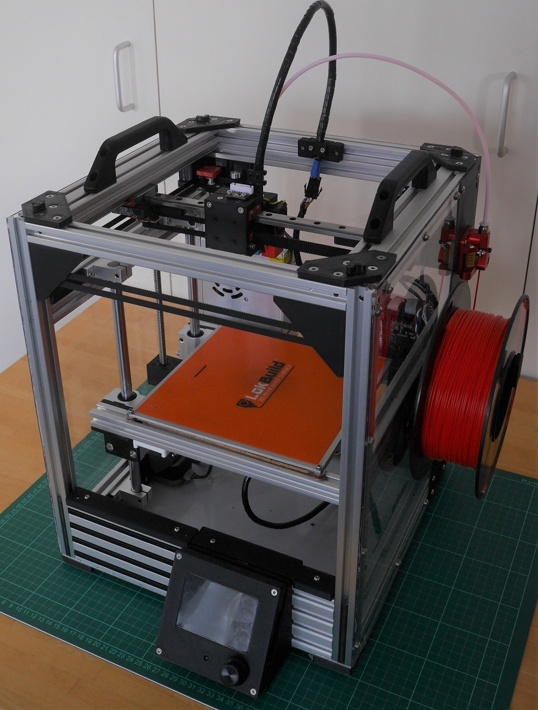
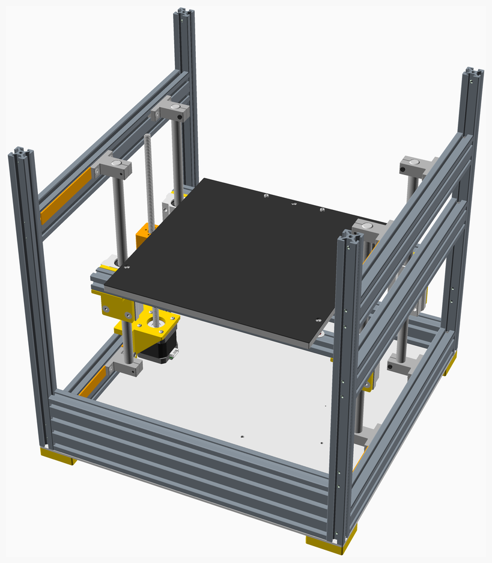
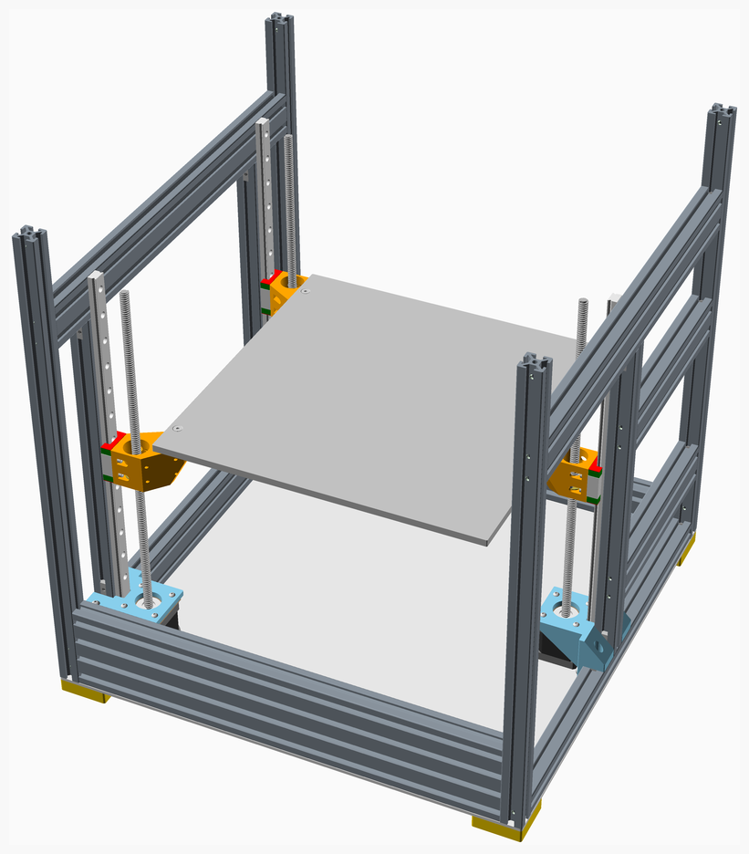
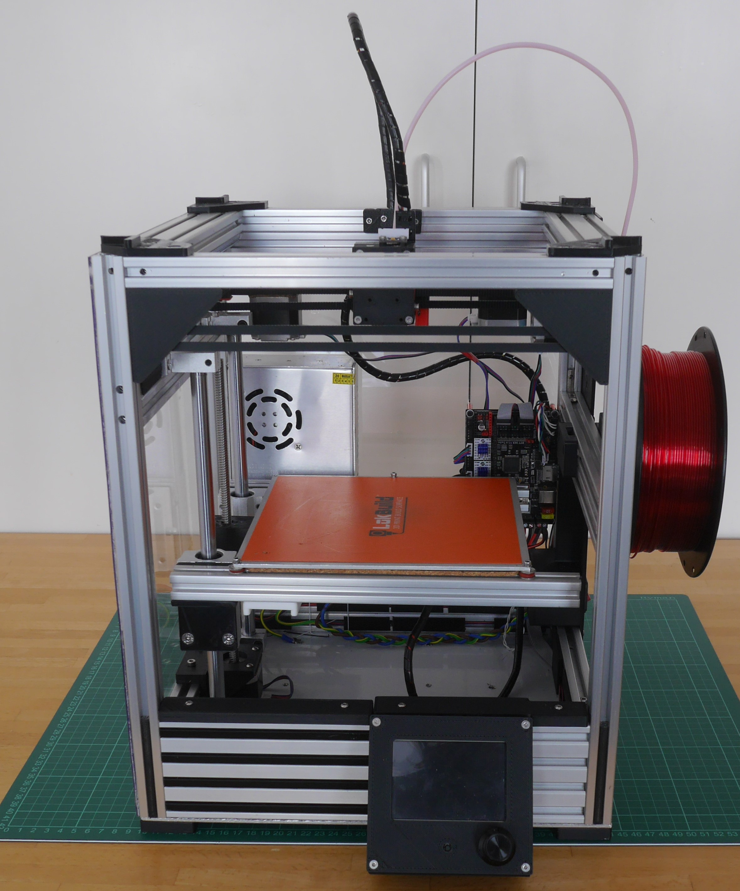
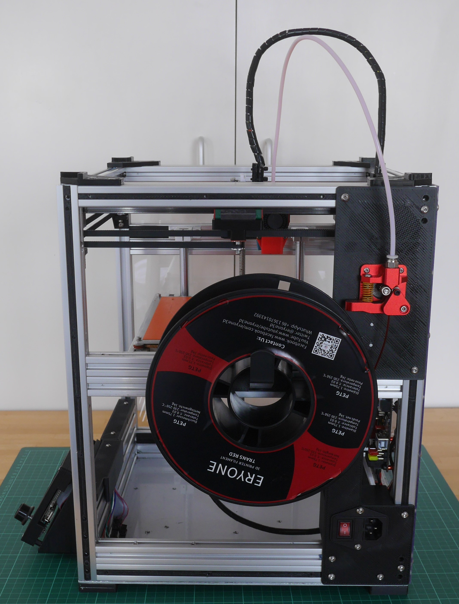
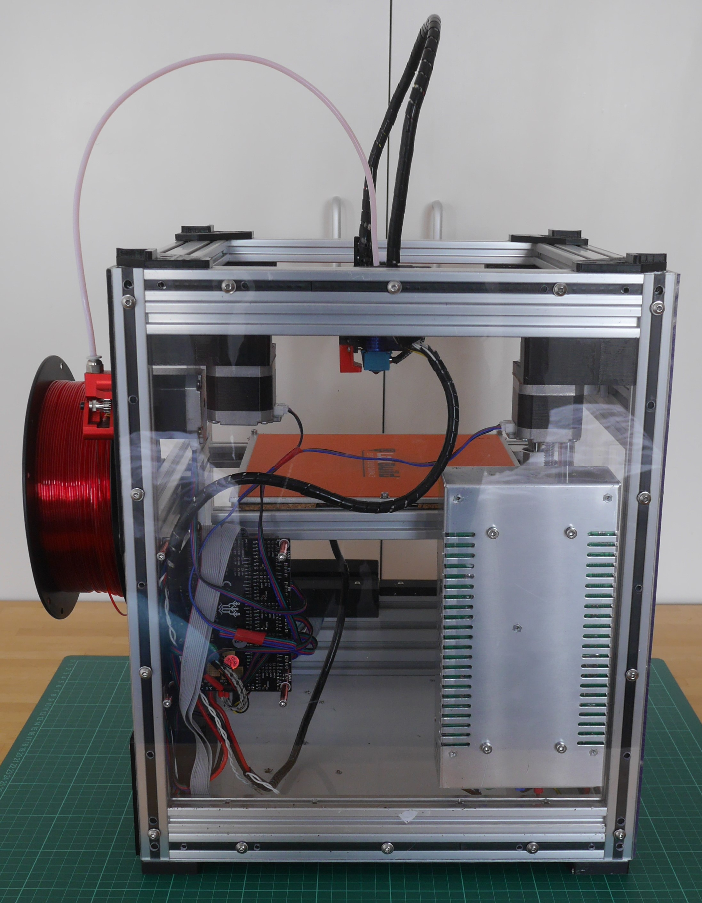
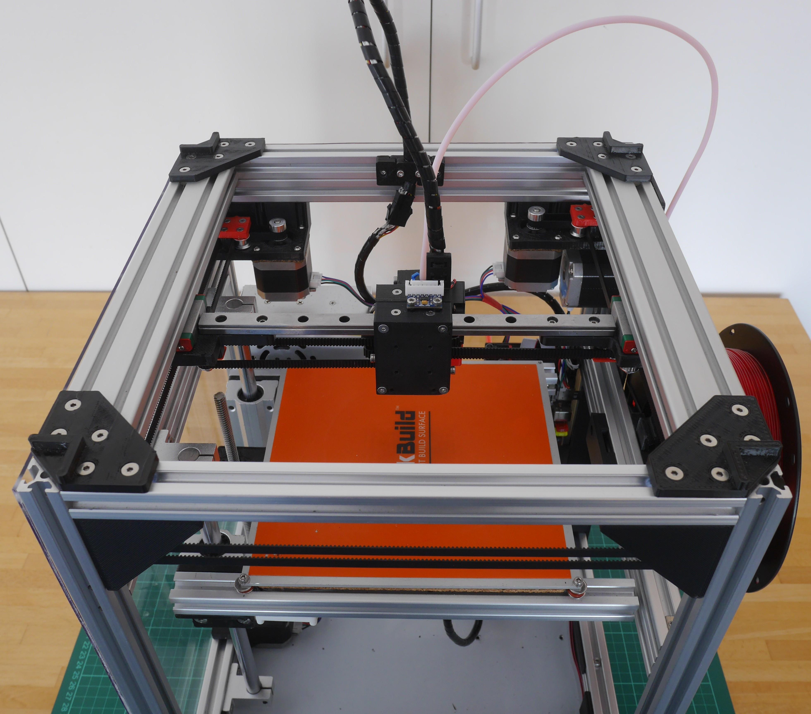
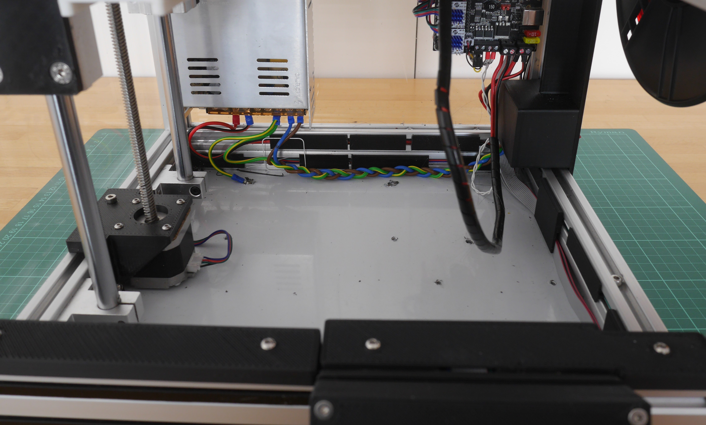

# MaybeCube

The **MaybeCube** is a fully-featured, rigid, high speed, and affordable CoreXY 3D printer with a linear rails motion system.

It can be built in a variety of sizes: the standard size is the MC350, which has external dimensions of approximately
405mm by 475mm by 415mm and a build volume of approximately 225mm x 225mm x 200mm.

The self-sourcing BOM cost of the MC300 variant is approximately £430 with a genuine E3D hotend (or about £400 with a generic E3D compatible hotend), this does not include the cost of filament for printing parts, see [spreadsheet](documents/BOM_MC300.ods). The MC350 variant is slightly more expensive.

## Assembly instructions

The "standard" size is the MC350 variant. I have built the MC300 variant for two reasons: to test sizing (if the components fit in the MC300 variant, then they will fit in larger variants); and because I had a quantity of 300mm extrusion and the right size heated bed from an earlier project.

The assembly instructions and the BOM (parts list) for the MC300 variant are [here](https://github.com/martinbudden/MaybeCube/blob/main/MC300/readme.md).

The assembly instructions and the BOM for the MC350 variant are [here](https://github.com/martinbudden/MaybeCube/blob/main/MC350/readme.md).

Please read all the build instructions before you begin assembly.

The STL files are on [thingiverse](https://www.thingiverse.com/thing:4912095).

The assembly of the different MC300 and MC350 variants is essentially the same, the main differences are in the printbed. Larger variants naturally have a larger printbed and to support this can optionally have Z-rods on both sides of the printbed.

If you would like to build a smaller printer, you may be interested in the MaybeCube's smaller sibling, the [BabyCube](https://github.com/martinbudden/BabyCube).

## Design Goals

1. **Create a high quality engineered 3D printer capable of producing high quality prints**
2. **Make the MaybeCube more easily usable in home environment (as opposed to garage or workshop)**
     * try and make it easy to transport and store the MaybeCube, so:
     * integrated design, everything is enclosed within the printer's frame with. This includes the motors,
       the motion system, the power supply, and the circuit boards. The only exceptions are the spool
       holder, which can be removed for transport and storage, and the extruder.
     * include base plate so underside of printer is not exposed
     * all protrusions from frame (filament spool, extruder, power connector) are on the right hand side to minimise desk clutter
       and allow the back of the MaybeCube to be pushed right against a wall
     * all protrusions from the frame can be easily removed for storage
     * clean wiring - route wiring in extrusion channels where possible and minimise exposed wiring
3. **Improve ease of assembly**
     * Use internal blind joints on the frame
     * printed parts designed so that bolts are accessible and can be tightened when frame fully assembled (that is bolt holes are not blocked by other parts when assembled)
     * divide the main assembly into a number of independent sub-assemblies.
     * where possible printed parts push up right against frame and so "auto-align"
     * facilitate building in different size variants
4. **Use linear rails for the x and y axes**
     * linear rails are now not much more expensive than linear rods
     * linear rails make design and assembly easier, reducing the need for custom printed parts
     * linear rods are used for the z-axis, since linear rails offer no advantage here
5. **Maximise frame rigidity**
     * one of my goals is to experiment with high print speeds. A highly rigid frame allows higher acceleration settings
     * use 2040 aluminium extrusion, corner joints are about 4 times more rigid than 2020 corner joints and 2-3 times more rigid than 3030 corner joints
6. **Maximise build volume for selected extrusion lengths**
     * Z-axis assembly is on the left side of MaybeCube. This means the Z-axis assembly does not impede travel in the Y direction
     * The printhead is quite compact, so does not significantly restrict travel in the X and Y directions
7. **Enable a fully enclosed print volume**
     * The cubic shape makes enclosure straightforward.
     * A panel can be used to isolate the electronics and stepper motors from the build volume
     * A slide-in front panel can be added
     * A top enclosure can be placed on the frame
8. **Try and keep the costs down**
     * the aim is not to be as cheap as possible, but rather to avoid unnecessary costs
     * use standard extrusions lengths, as far as possible, so no custom cutting is required
9. **Facilitate customisation and experimentation**
     * Open source design
     * Parametric design in OpenSCAD
     * The open design of the frame and the easy accessibility of parts means the MaybeCube is fairly easy to customise - most parts can be changed without the need to disassemble large parts of the frame
     * The design of the X_Carriage means it is easy to customise to support different hotends and extruders
     * Support other printhead systems, including EVA, XChange, and, in principle, the Jubilee and E3D toolchangers
     * The independence of the XY motion system and the Z motion system means that in principle the Z motion system could be replaced (with, say, an auto-tramming 3-point leveling system)

## Variations

The canonical form is the MC350 variant.

variant | ExtrusionSizes | Rail/rod lengths | Approx Build Volume | Bed Size   | Exterior Dimensions
------- | -------------- | ---------------- | ------------------- | ---------- | -------------------
MC250   | x250 y250 z350 | x200 y250 z250   | concept variant     | 180mm      | 290 x 290 x 350
MC300   | x300 y300 z400 | x250 y300 z300   | 185 x 185 x 200     | 214mm      | 340 x 340 x 400
MC350   | x350 y350 y400 | x300 y350 z300   | 225 x 225 x 200     | 235mm      | 390 x 390 x 400
MC400   | x400 y400 y450 | x350 y400 z350   | 275 x 275 x 250     | 310mm      | 440 x 440 x 450

## Comparisons

The following table compares the sizes and build volumes of various CoreXY 3D printers.

Printer           | EType | Extrusion lengths | Build Volume     | Exterior Dimensions
------------------|------ | ----------------- | ---------------- | -------------------
MC300             | 2040  | 300 x 300 x 400   | 180 x 180 x 200  | 340 x 340 x 400
MC350             | 2040  | 350 x 350 x 400   | 225 x 225 x 200  | 390 x 390 x 400
MC400             | 2040  | 400 x 400 x 450   | 275 x 275 x 250  | 440 x 440 x 450
MC450             | 2040  | 450 x 450 x 500   | 325 x 325 x 300  | 490 x 490 x 500
[BLV MGN Cube](https://www.blvprojects.com/blv-mgn-cube-3d-printer) | 2040 | 496 x 496 x 560 | 300 x 300 x 365 | 576 x 536 x 560
[Denali 200](https://github.com/Annex-Engineering/Denali) | 2020 | 320 x 320 x 590 | 200 x 200 x 200 | 380 x 380 x 620 (est)
Denali 250 | 2020 | 370 x 370 x 590 | 250 x 250 x 200 | 430 x 430 x 620 (est)
Denali 350 | 2020 | 470 x 470 x 690 | 350 x 350 x 300 | 530 x 530 x 720 (est)
[E3D ToolChanger](https://e3d-online.com/pages/toolchanger) | 2040 | Z: 500 |  200 x 300 x 300  | 530 x 505 x 500
[FuseBox3](https://github.com/alexyu132/fusebox3) | 2020 | 310 x 332 x 407 | 235 x 235 x 235 | 350 x 372 x 427
[HyperCube](https://www.thingiverse.com/thing:1752766) | 2020 | 340 x 303 x 350  | 200 x 200 x 155  | 380 x 343 x 350
[HEVO](https://www.thingiverse.com/thing:2254103) | 3030 | 420 x 410 x 500 | 300 x 300 x 300 | 480 x 470 x 500
[HevORT 315](https://miragec79.github.io/HevORT/) | 3030 | 410 x 420 x 880 | 315 x 315 x 340 | 640 x 480 x 890 (est)
HevORT 415                                        | 3030 | 510 x 520 x 980 | 415 x 415 x 440 | 740 x 480 x 990 (est)
[Jubilee](https://www.jubilee3d.com/index.php?title=Main_Page) | 2020 | 409 x 604 x 430 | 300 x 300 x 300 | 476 x 604 x 558
[RatRig V-Core3 300](https://v-core.ratrig.com/#customization) | 3030 | 440 x 505 x 510 | 300 x 300 x 300  | 518 x 583 x 560
RatRig V-Core3 400 | 3030 | 540 x 605 x 610 | 400 x 400 x 400  | 618 x 683 x 660
RatRig V-Core3 500 | 3030 | 640 x 705 x 710 | 500 x 500 x 500  | 718 x 783 x 760
[RailCore II 300ZL](https://railcore.org/) | 1515 | 400 x 370 x 360 | 250 x 250 x 280 | 522 x 445 x 496
RailCore II 300ZL  | 1515 | 460 x 425 x 445 | 300 x 300 x 330 | 572 x 495 x 546
RailCore II 300ZLT | 1515 | 460 x 425 x 745 | 300 x 300 x 600 | 572 x 495 x 830
[SimpleCore 200](https://github.com/rolohaun/SimpleCore) | 2020 | 350 x 350 x 450 | 200 x 200 x 180 | 390 x 390 x 390 (est)
SimpleCore 300 | 2020 | 500 x 500 x 500 | 330 x 330 x 230 | 540 x 540 x 540 (est)
[SnakeOil XY 180](https://github.com/ChipCE/SnakeOil-XY) | 3030 | 310 x 310 x 500 | 180 x 180 x 180 | 400 x 390 x 520 (est)
SnakeOil XY 250 | 3030 | 400 x 370 x 550 | 250 x 240 x 230 | 490 x 450 x 570 (est)
[Ultra MegaMax Dominator](https://drmrehorst.blogspot.com/2017/07/ultra-megamax-dominator-3d-printer.html) | 4040 | | 300 x 300 x 695 | 610 x 530 x 1500
[Voron2 v2.4 250](https://vorondesign.com/voron2.4) | 2020 | 410 x 410 x 430 | 250 x 250 x 230 | 450 x 450 x 430
Voron2 v2.4 300    | 2020 | 460 x 460 x 480 | 300 x 300 x 280 | 500 x 500 x 480
Voron2 v2.4 350    | 2020 | 510 x 510 x 530 | 350 x 350 x 330 | 550 x 550 x 530
[VzBot](https://github.com/VzBot3D/VzBot) | 2020/2040 | 530 x 460 x 530 | 330 x 330 x 400 | 530 x 500 x 570

## Frame stiffness

The MaybeCube is a cuboid with 6 rectangular faces. Rectangles have no inherent rigidity and are subject to shearing. The rigidity of a rectangle is provided solely by the strength of its joints, and these often do not provide sufficient rigidity.
A small movement at a joint is magnified into a much larger movement at the end of a 400mm extrusion.
There are three main ways to increase the rigidity of rectangles:

1. triangulation, where the a diagonal piece divides the rectangle into two triangles, this is exemplified in [truss bridges](https://en.wikipedia.org/wiki/Truss_bridge)
2. using a shear plate, this is exemplified in the [sheer boards](https://en.wikipedia.org/wiki/Shear_wall) used to stiffen wooden framed buildings
3. reinforcing the joints.

The MaybeCube uses 2040 extrusions, these provide significantly more joint rigidity than either 2020 or 3030 extrusions. Additionally the MaybeCube uses shear plates on the bottom, back, and (optionally) left and right faces to stiffen the frame.

The front face of the MaybeCube is the most subject to shearing, since it needs to be open to allow access to the printbed. Two measures are taken to counteract this: 2080 rather than 2040 extrusion is used at the bottom of the face, and the idler mounts at the top are extended to provide some triangulation and reinforcement of the upper joints.

## Input shaper test results (MC300 variant with side panels)

### Comparison of input shaper test results

Printer                                                    | X frequency | X amplitude | X acc limit | Y frequency | Y amplitude | Y acc limit
---------------------------------------------------------- | ----------- | ----------- | ------------| ----------- | ----------- | -----------
MC300                                                      |         114 |       1,720 |      51,200 |          88 |       4,500 | 32,800
[BabyCube](https://github.com/martinbudden/BabyCube)       |          92 |      19,000 |      32,600 |          87 |      13,500 | 44,100
[RatRig V-Core3 300](https://youtu.be/ZAN9zTTPUq8?t=765)   |          62 |      47,500 |      15,300 |         N/A |         N/A | N/A
[SnakeOil XY](https://github.com/ChipCE/SnakeOil-XY)       |          83 |     110,000 |      27,400 |          56 |      49,500 | 12,100
[VzBot](https://youtu.be/hTF4bWBTqDQ?t=298)                |          93 |      87,000 |      34,100 |          64 |      35,500 | 15,900
[Voron 2.4](https://youtu.be/a775O9luKgA?t=7100)           |     52 & 82 |      15,400 |      26,500 |     38 & 63 |      11,600 |  9,900
[Voron Switchwire](https://youtu.be/OoWQUcFimX8?t=635)     |          70 |      11,000 |         N/A |          48 |      16,200 | N/A
[Ender 3](https://www.youmaketech.com/klipper-on-ender-3/) |     30 & 88 |       4,100 |       3,800 |     32 & 57 |      19,000 |  9,300
[Prusa i3 MKS+](https://forum.prusaprinters.org/forum/original-prusa-i3-mk3s-mk3-general-discussion-announcements-and-releases/prusa-i3-mks3-resonance-profiles-input-shaper/) | 38 & 58 | 39,000 | N/A | 32 & 78 | 42,000 | N/A

These input shaper results give a rough idea of the rigidity of various printers. The acc limit is the value of the max acceleration for the ZV shaper for each printer and axis - it is not that meaningful in itself, but it does form some basis for comparison.

It does seem that the MC300 compares very favourably with the other printers for which I have found results published.

## Customisations

### EVA module printhead system

In its default configuration the MaybeCube has an E3D V6 hotend with a Bowden extruder. However I've created adaptors
so that the [EVA modular printhead system](https://main.eva-3d.page) can be used. The EVA system supports a wide variety
of hotends and extruders. More details on using the EVA adaptors are [here](https://github.com/martinbudden/MaybeCube/tree/main/EVA).

The STL files are on [thingiverse](https://www.thingiverse.com/thing:4912099).

### Printermods XChange quick change tool head

I've created an adaptor for the
[Printermods XChange quick change tool head](https://www.kickstarter.com/projects/printermods/xchange-v10-hot-swap-tool-changing-for-every-3d-printer).
More details on using the XChange adaptor are [here](https://github.com/martinbudden/MaybeCube/tree/main/XChange).

The STL files are on [thingiverse](https://www.thingiverse.com/thing:4924355).

### Voron Mini Afterburner printhead

I've created an adaptor for the Voron Mini Afterburner (as used on the [Voron V0](https://github.com/VoronDesign/Voron-0)) printhead.

More details on using the Voron Mini Afterburner adaptor are [here](https://github.com/martinbudden/MaybeCube/tree/main/Voron_Mini_Afterburner).

The STL file is [here](https://github.com/martinbudden/MaybeCube/blob/main/Voron_Mini_Afterburner/stls/X_Carriage_Voron_Mini_Afterburner.stl).

### E3D tool changer

Currently there is no adaptor for the  [E3D tool changer](https://e3d-online.com/pages/toolchanger), however I think it would be fairly straightforward to create one.

There should be room to dock at least two, and perhaps three [E3D ToolChanger Tools](https://e3d-online.com/products/toolchanger-tools) in the back of the MC350, this would allow experimenting with the E3D docking system in a framework considerably less expensive than the [E3D Motion System](https://e3d-online.com/products/e3d-motion-system).

### Jubilee tool changer

The [Jubilee 3D printer](https://www.jubilee3d.com/index.php?title=Main_Page)
has a [tool changer](https://www.jubilee3d.com/index.php?title=Tools)
compatible with the E3D tool changer. I have a proof of concept showing that this tool changer system can be used on the MaybeCube. Note that this is incomplete and still requires an X_Carriage adaptor for the Jubilee plates.

### Dual Z rods

The MC300 variant uses a cantilevered print bed. For larger variants it is possible to use dual sets of Z-rods to support the print bed.

### 3-point Kinematic Bed

It is possible to configure the MaybeCube to use a 3-point Kinematic Bed

## Pictures

## License

MaybeCube is licensed under the [Creative Commons Attribution-NonCommercial-ShareAlike 4.0 International License](https://creativecommons.org/licenses/by-nc-sa/4.0/)
(CC BY-NC-SA 4.0) 

